<!-- Built by scripts/build_assets.py. Edit the CONTENT section there, not the SVGs. -->

<picture><source media="(prefers-color-scheme: dark)" srcset="./assets/hero-dark.svg">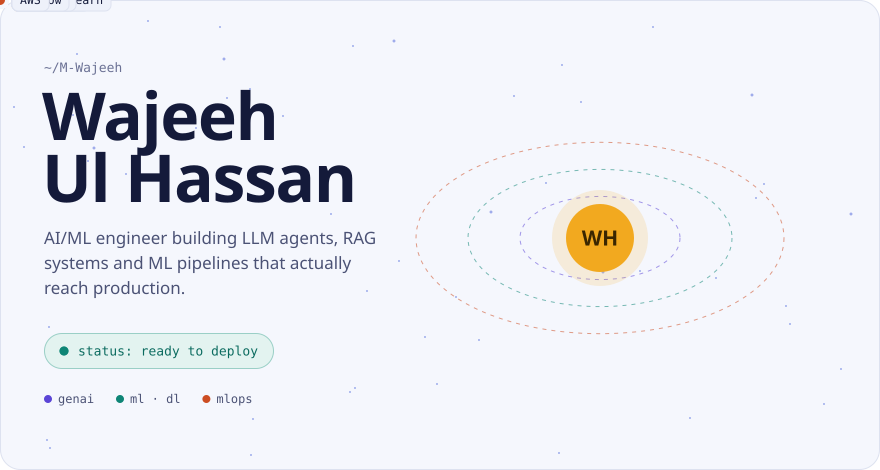</picture>

<picture><source media="(prefers-color-scheme: dark)" srcset="./assets/facts-dark.svg"></picture>

<h3><code>$ mlflow run career --experiment wajeeh</code></h3>

<picture><source media="(prefers-color-scheme: dark)" srcset="./assets/pipeline-dark.svg">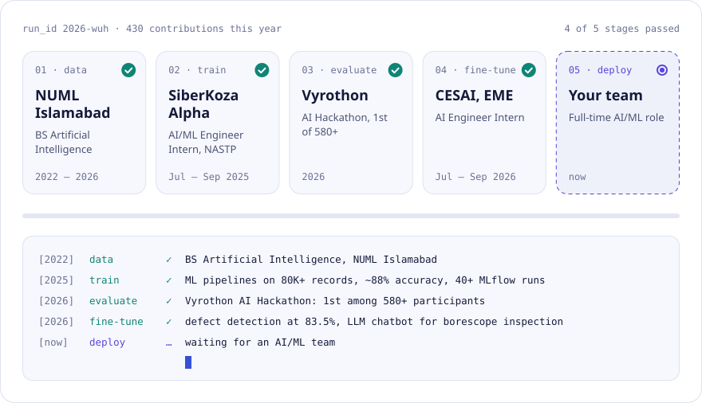</picture>

<h3><code>$ mlflow metrics show</code></h3>

<picture><source media="(prefers-color-scheme: dark)" srcset="./assets/metrics-dark.svg">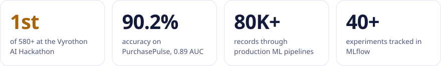</picture>

<h3><code>$ ls ./artifacts</code></h3>

<!-- TODO: replace the two https://github.com/M-Wajeeh links below with the Try-On and Vehicle Insurance repo links -->
<a href="https://github.com/M-Wajeeh"><picture><source media="(prefers-color-scheme: dark)" srcset="./assets/project-tryon-dark.svg">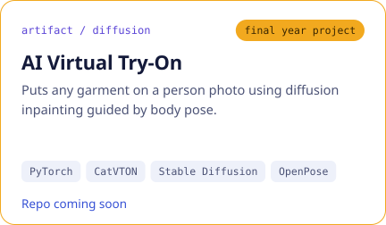</picture></a>
<a href="https://github.com/M-Wajeeh/PurchasePulse-Real-Time-Intent-Prediction"><picture><source media="(prefers-color-scheme: dark)" srcset="./assets/project-purchasepulse-dark.svg">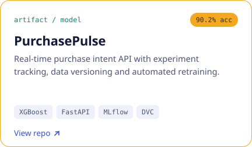</picture></a>
<a href="https://github.com/M-Wajeeh/RAG-Insight-Engine"><picture><source media="(prefers-color-scheme: dark)" srcset="./assets/project-rag-dark.svg">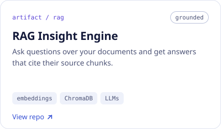</picture></a>
<a href="https://github.com/M-Wajeeh/n8n-AI-Search-Assistant"><picture><source media="(prefers-color-scheme: dark)" srcset="./assets/project-n8n-dark.svg">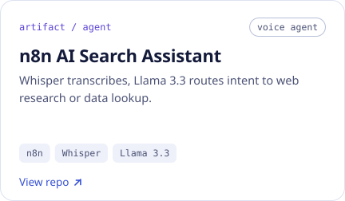</picture></a>
<a href="https://github.com/M-Wajeeh"><picture><source media="(prefers-color-scheme: dark)" srcset="./assets/project-insurance-dark.svg">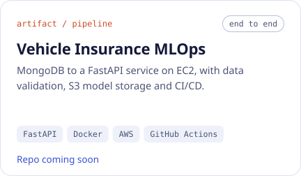</picture></a>
<a href="https://github.com/M-Wajeeh/sql-customer-analytics"><picture><source media="(prefers-color-scheme: dark)" srcset="./assets/project-sql-dark.svg">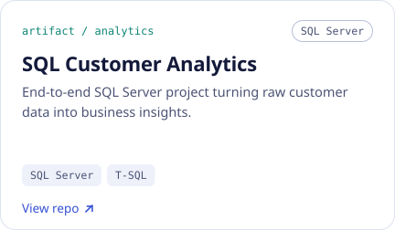</picture></a>

<h3><code>$ curl wajeeh.dev/endpoints</code></h3>

<a href="https://m-wajeeh.dev"><picture><source media="(prefers-color-scheme: dark)" srcset="./assets/endpoint-portfolio-dark.svg"></picture></a>
<a href="https://www.linkedin.com/in/hassanwajeeh"><picture><source media="(prefers-color-scheme: dark)" srcset="./assets/endpoint-linkedin-dark.svg">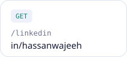</picture></a>
<a href="https://github.com/M-Wajeeh"><picture><source media="(prefers-color-scheme: dark)" srcset="./assets/endpoint-github-dark.svg"></picture></a>
<a href="mailto:wajeeh9233@gmail.com"><picture><source media="(prefers-color-scheme: dark)" srcset="./assets/endpoint-hire-dark.svg"></picture></a>

 

<picture><source media="(prefers-color-scheme: dark)" srcset="./assets/extras-dark.svg">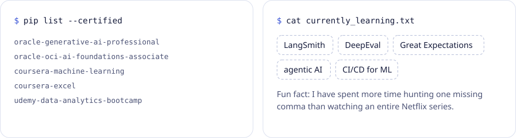</picture>

 

<code>$ exit</code> 
Open to AI/ML roles in Islamabad, Rawalpindi and Lahore · <a href="mailto:wajeeh9233@gmail.com">wajeeh9233@gmail.com</a>

